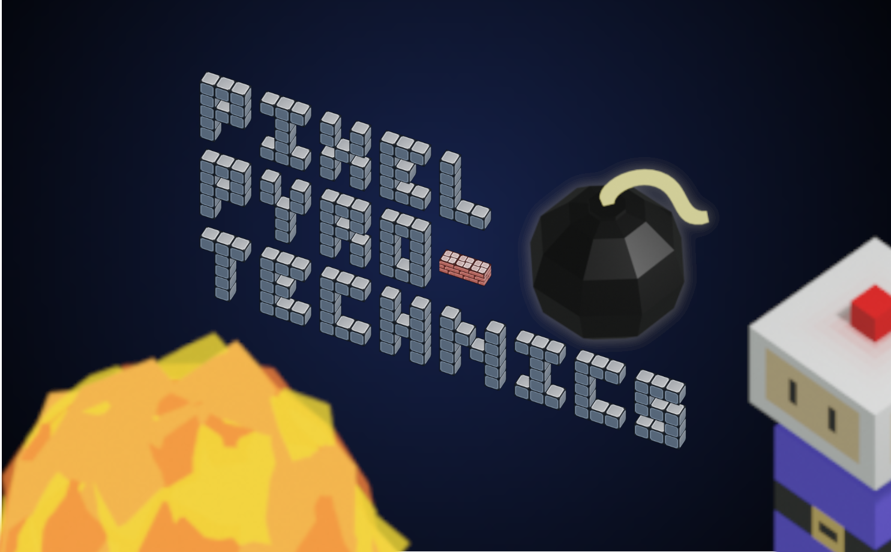

Submission to Ubisoft Toronto Next 2023

## Play game

https://chip2222.itch.io/pixel-pyrotechnics

## Build game

Open GameTest.sln in Visual Studio 2019, and run in debug or release mode.
To create a standalone runnable build, copy the `assets` folder into the same directory as the executable.

## File structure

`App`: Ubisoft API, unchanged

`assets`: textures

`GameTest.cpp`: game logic (changed from original)

--

`src`: new files. As a rule of thumb, all new files are only concerned with game state. Any actual game logic should only exist in `GameTest.cpp`

`src/GameObject.cpp` : tree structure of game objects to allow for local and global positioning

`src/Hud.cpp` : inherits from `GameObject`, contains hud state and manages 2d overlay sprites

`src/LevelObject.cpp` : inherits from `GameObject`, contains level state and manages all 3D sprites

`src/SpriteObject.cpp` : inherits from `GameObject`, wrapper for a single sprite with a local and global position

`src/Item3D.cpp` : inherits from `SpriteObject`, contains 3d state and handles conversion from world to screen coordinates

